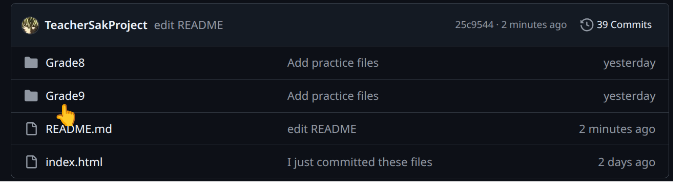
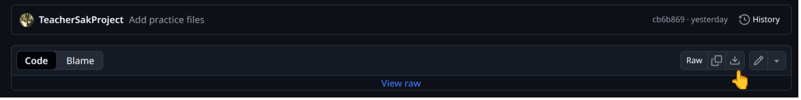

This is a README that provide the basic of accessing(downloading) files from this GitHub repo.

<!--One thing to note is that using "git add ." will stage all files in current working directory. If there's an empty folder,
it will not stage it all unless there's a file within it.-->
**** 
# 😃😹 $${color{green}You just click on the folder of your grade and click the files inside to download it.}$$ 😹😃
****

For example, you can click on the folder Grade 9 to find my database, 
open it and select the file you need. 
Then you can download it by click the download button.

<!---->

